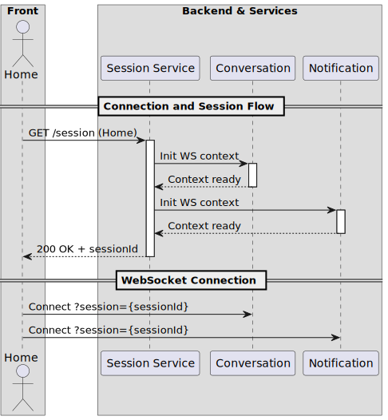
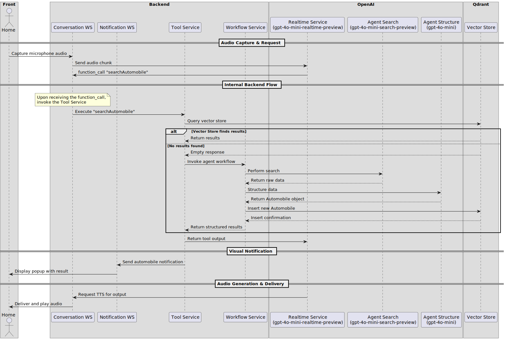

# AIgents


The **aigents** repository is the main codebase for a project developed during Microsoft’s AI Agents Hackathon 2025 (April 8–30). This project builds an AI-agent system that helps users acquire vehicles by offering personalized recommendations and automating key steps in the purchasing journey.

## Flows

This section describes the main system flows using diagrams generated from PlantUML files.

### Session Setup Flow

[View source (`docs/session-setup.puml`)](docs/session-setup.puml)



### Vehicle Acquisition Flow

[View source (`docs/automobile_flow.puml`)](docs/automobile_flow.puml)



---

## Overview

Aigents orchestrates multiple AI agents to provide:

- **Search** for vehicle specifications
- **Comparison** across different models
- **News** from the automotive industry

The core architecture includes:

1. **Frontend** (`aigents-site`): Interactive UI built with Nuxt/Vue
2. **Backend** (`aigents-api`): HTTP and WebSocket API in NestJS, real-time audio/text streaming
3. **Semantic Storage**: Qdrant for vector-based search
4. **File Storage**: MinIO for assets and logs

## Repository Structure

```text
.
├── aigents-site        # UI (Nuxt 3 / Vue 3) — see the README in that submodule
├── aigents-api         # REST/WS API (NestJS) — see the README in that submodule
├── .gitmodules         # Submodule definitions
├── docker-compose.yml  # Docker services: Qdrant and MinIO
└── example.env         # Sample environment variables file
```

## How We Tackled the Challenges

During development, we encountered several hurdles and made key decisions:

- **Primary Data Sources Unavailable**  
  We wanted to pull data directly from dealerships and U.S. vendors, but most don’t offer public APIs or require formal agreements. To work around this, we rely on web search engines (avoiding scraping due to legal and privacy concerns).

- **Discontinued Bing API**  
  We attempted to use the Bing API but discovered it had been deprecated and replaced by a poorly documented service with no free tier. We evaluated other options accordingly.

- **Azure AI vs. OpenAI**  
  Although we explored Azure AI services, we already had OpenAI credits and wanted to keep the option to switch providers open, so we stuck with OpenAI for this hackathon.

- **Technical Debt**  
  - **Audio Pool Memory Leak**: If too many audio buffers accumulate, RAM usage spikes.  
  - **Incomplete “Images” Feature**: We lacked a reliable free-image API. We spent time on an automated image-filtering agent concept but ultimately fell back to stock images.  
  - **Long-Search Wait Indicator**: We aimed to play an audio alert for searches taking over 10 seconds. As a temporary fix, we added a “searching…” animation instead.

## Roadmap and Improvements

- **Enable More Interactive Dialogue During Waiting**  
  Consider allowing the system to engage users in richer conversation while awaiting search results. While this can enhance the demo experience, production constraints and budget considerations may favor maintaining a higher threshold for search feedback.

- **Full Migration to Azure AI Platform**  
  Deploy the entire solution on Azure, leveraging native AI services (AI Service, Realtime, and LLM) to reduce end-to-end latency by colocating compute resources.

- **Direct Provider Integration**  
  Build direct connections with vehicle providers’ APIs or establish realtime workflows to manage pricing comparisons and purchase inquiries. This feature would close the loop for an end-to-end automated purchasing pipeline.

## Prerequisites

- **Docker & Docker Compose** (v2 or higher)  
- **Node.js** and **pnpm** (only if developing inside the submodules)

## Environment Setup

1. Clone the repository and update submodules:

   ```bash
   git clone https://github.com/aigents-hub/aigents.git
   cd aigents
   git submodule update --init --recursive
   ```

2. Copy the example environment file and fill in your values:

   ```bash
   cp example.env .env
   ```

3. Edit `.env` to adjust credentials and paths for your environment.

## Starting the Docker Services

To spin up the semantic storage and file storage services:

```bash
docker-compose up -d
```

- **Qdrant**: Vector database (ports 6333/6334)  
- **MinIO**: S3-compatible file storage (port 9000; web console on 9001)  

> Once these services are running, proceed to install and run the frontend and backend separately.

## Next Steps

- **Frontend**:  
  Navigate to `aigents-site/` and follow the instructions in its [README](https://github.com/aigents-hub/aigents-site/blob/main/README.md).

- **Backend**:  
  Navigate to `aigents-api/` and follow the instructions in its [README](https://github.com/aigents-hub/aigents-api/blob/main/README.md).

---

## ⚠️ Hackathon Notice

This repository is a **proof of concept** for the Microsoft AI Agents Hackathon (Apr 8–30, 2025). It will **not** be maintained or extended beyond the hackathon period.

## Participants

| Name                          |
| ----------------------------- |
| Nicolás Alejandro Catalogna   |
| Juan Carlos Quintero          |
